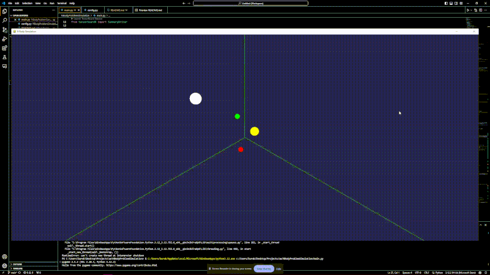
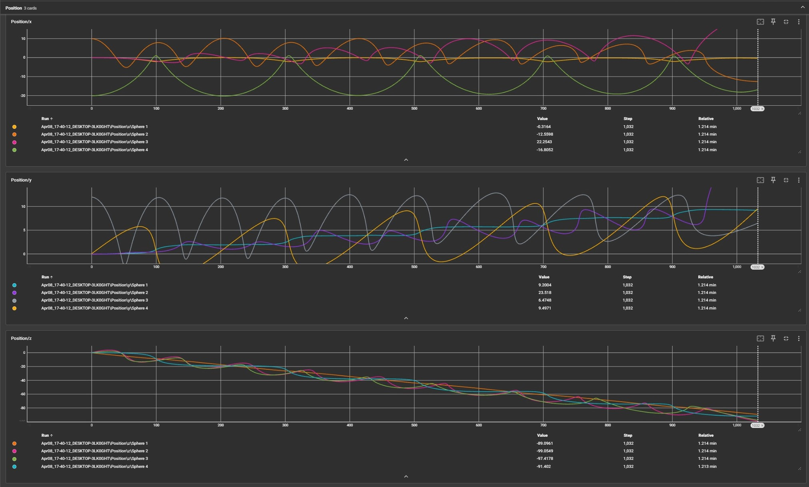

# N Body Problem Simulation With OpenGL

This project aims to simulate the well known N Body problem in physics. Code will be written in Python. After successful simulation of 2 body problem, data visulazition with tensorboard will be integrated.

## Results

### Simulation

Objects in the simulation can be modified from *main.py*. Simulation itself has a **collision detection** algorithm, so even though there might be an illusion of collision, as long as it is not logged to the console, there is no collision.

### TensorBoard

X, Y and Z components of position, velocity and acceleration are logged into the tensorboard run for every object at the simulation. After/During the run of simulation, the following command will start the tensorboard dashboard, provided it is installed.

`python -m tensorboard.main --logdir runs`

From there, every vector component can be analyzed indivudally & per time discrete.

## Time Discretization Policy

For simulating purposes, we will generate **60 frames per second**. If user wants real time speed to match the simulation speed, s/he can set *config.TIME_DISCRETE* to reciprocal of *config.FPS*. This will not promise a perfect time alignment, but error range will be small enough to ignore.

To increase the speed of simulation, *config.FPS* or/and *config.TIME_DISCRETE* can be increased. However, the latter is not recommended since it will disrupt the continuity illusion.

## Markov Policy

Markov rule **will be followed** at each step.

## Coordinate System

Coordinate system definitions above (1*) is valid.

Even though camera has settings for rotation and zoom, using the initial Camera coordinates for this task and sticking with them is recommended. Check the definition:

`self.camera.look(from_position=(10,10,10), to_position=(0, 0, 0))` @main.py init function of the class *App*

## Unit System

**SI Unit system** will be valid. Distance values on the simulation will be in meters

## Force & Acceleration and Integration Calculations

We will only calculate the gravitational forces, by respecting any initial speed objects may or may not have. Electromagnetic, weak, and strong forces will be ignored.

The formula for the gravitational force is as follows:

`F = G * (m1 * m2) / r^2`

Where:

- **F** is the force in `[N]`
- **G (6.67430 x 10-11)** is the gravitational constant in `[m^3 kg^-1 s^-2]`
- **m1** and **m2** are the masses in `[kg]`
- **r** is the distance between the centers of the masses in `[m]`

For the sake of simplicity, we will take our spheres as point masses, so the center of the mass will be the center of the sphere. Also, all of the mass of the object will be assumed concentrated in the center.

Acceleration will be calculated by the formula:

`a = ΣF / m`

> **_NOTE:_**  For 2 Body problem, ΣF is F.

Where:

- **a** is the acceleration in `[m/s^2]`

We will use the **Euler's Method** for integration. It is the simplest method, and it is not as accurate as other methods. However, it is the fastest and easiest to implement. We will use it for the sake of simplicity.

`v = v + a * dt`

`x = x + v * dt`

Where:

- **v** is the velocity in `[m/s]`
- **a** is the acceleration in `[m/s^2]`
- **x** is the position in `[m]`
- **dt** is the time step in `[s]` and equal to **config.TIME_DISCRETE**

## To-Do

- [x] Create the 3D Environment
- [x] Add Newtonian Coordinate Map to the Main Screen
- [x] Finalize time discretization process
- [x] Finalize the simulation for 2 body problem
- [x] Plot Results to TensorBoard
- [x] Simulate the N body problem
- [x] Share plotted results

## Dependencies

- numpy
- pyopengl
- pygame
- tensorboard

## License

MIT-License Applies

## References

1. https://learnopengl.com/Getting-started/Coordinate-Systems